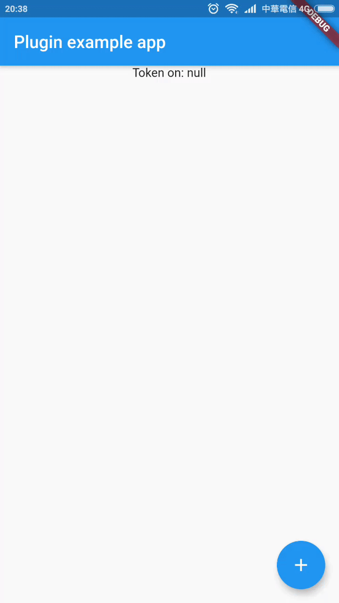

# FlutterTappay

[](https://pub.dartlang.org/packages/flutter_tappay)

A Flutter plugin to slove Tappay sdk. (only Direct pay and Android for now.)



## Usage
To use this plugin, add `flutter_tappay` as a [dependency in your pubspec.yaml file](https://flutter.io/platform-plugins/).

## Preparation
There is something that need to add before using this plugin, please follow the steps:

1. Add default activity styles under `res/values/styles.xml`

```
    <style name="AppCompactTheme" parent="Theme.AppCompat.Light.DarkActionBar">
    </style>
```

2. Add activity under `AndroidManifest.xml`, just below flutter activity.

```
    <activity
      android:name="github.tokenyet.flutter_tappay.TappayActivity"
      android:theme="@style/AppCompactTheme"
    >
    </activity>
```

That's it.

### Example

``` dart
// Import package
import 'package:flutter_tappay/flutter_tappay.dart';

// Instantiate it
FlutterTappay payer = FlutterTappay ();

// Listen to token
payer.onTokenReceived.listen((data) {
  setState(() {
    _token = data;
  });
}, onError: (err){ print("$err");}, onDone: (){ print("done");});

// Show Payment (The key and the id is the api that used in [official web demo](https://tappay.github.io/tappay-web-example/TapPay_Fields/example/index.html))
await FlutterTappay.showPayment(
  title: "Custom Title",
  btnName: "Custom BtnName",
  appKey: "app_whdEWBH8e8Lzy4N6BysVRRMILYORF6UxXbiOFsICkz0J9j1C0JUlCHv1tVJC",
  appId: 11334,
  serverType: FlutterTappayServerType.Sandbox
);
```

## More Info
It's really frustrated for flutter users to use ugly UI with native Android, If you are good at Android, please feel free to customize `layout/activity_main.xml` to make It more beauty, Moreover, pull request is welcome!

If you are using DirectPay only. The oher options might be just call API directly, since there is no rules for Tappay to prevent this happened, but this package is target to intergation with native method, that provided by [official documentation](https://docs.tappaysdk.com/tutorial/zh/android/front.html#tpdsetup).


## Contribution
Again, If you are better on Android, fork and pull request to improve the layout! If you will add more feature on FlutterTappay, Add in example and gif It in PR :)
